# Realm of Valor - Modular Architecture Refactor Plan

## 🎯 Goal
Transform the monolithic codebase into a **modular, AI-friendly architecture** where:
- Files are small (max 200-300 lines)
- Features are isolated and self-contained
- AI agents can easily find and edit specific functionality
- Admin panel creates content that appears **instantly** in the mobile app
- All Firebase keys/config are preserved

---

## 📐 Architecture Principles

### 1. Feature-Based Modules
Each feature is a **self-contained folder** with:
- `README.md` - What this feature does, how to edit it
- `components/` - UI components (max 200 lines each)
- `hooks/` - React hooks (max 150 lines each, one responsibility per hook)
- `services/` - Business logic (max 300 lines each)
- `types/` - TypeScript types specific to this feature
- `utils/` - Helper functions
- `__tests__/` - Unit tests

### 2. File Size Guidelines
| File Type | Max Lines | Purpose |
|-----------|-----------|---------|
| Component | 200 | Render one thing |
| Hook | 150 | One responsibility |
| Service | 300 | One domain |
| Type | 100 | Related types only |
| Util | 100 | Pure functions |

### 3. AI-Friendly Structure
```
features/map/rendering/MapContainer.tsx
            ↑       ↑           ↑
         feature subsystem  component name

AI prompt: "Edit how the map looks" → finds features/map/rendering/
AI prompt: "Change quest rewards" → finds features/quests/progression/QuestRewards.ts
AI prompt: "Fix player tracking" → finds features/map/tracking/PlayerTracker.ts
```

---

## 🏗️ New Project Structure

```
Rov-Soulforge/
├── apps/
│   ├── mobile/                           (Expo React Native)
│   │   ├── app/
│   │   │   ├── (tabs)/
│   │   │   │   ├── index.tsx            (Map Screen - refactored to ~100 lines)
│   │   │   │   ├── inventory.tsx        (Inventory - refactored)
│   │   │   │   ├── companion.tsx        (Companion - refactored)
│   │   │   │   ├── profile.tsx          (Profile)
│   │   │   │   ├── decks.tsx            (Deck Builder - refactored)
│   │   │   │   ├── leaderboard.tsx      (Leaderboard)
│   │   │   │   └── stash.tsx            (Stash)
│   │   │   ├── battle/
│   │   │   │   └── [id].tsx             (Battle Screen - new, working)
│   │   │   └── ... (other routes)
│   │   │
│   │   ├── features/                     ⭐ NEW - All features here
│   │   │   │
│   │   │   ├── map/                      🗺️ MAP SYSTEM
│   │   │   │   ├── README.md
│   │   │   │   ├── rendering/           (How map looks)
│   │   │   │   │   ├── MapContainer.tsx
│   │   │   │   │   ├── MapStyle.ts
│   │   │   │   │   ├── MapControls.tsx
│   │   │   │   │   └── index.ts
│   │   │   │   ├── tracking/            (Player location)
│   │   │   │   │   ├── PlayerTracker.ts
│   │   │   │   │   ├── LocationService.ts
│   │   │   │   │   ├── usePlayerLocation.ts
│   │   │   │   │   └── index.ts
│   │   │   │   ├── routing/             (Navigation/pathfinding)
│   │   │   │   │   ├── RouteCalculator.ts
│   │   │   │   │   ├── RouteRenderer.tsx
│   │   │   │   │   ├── AutoRouting.ts
│   │   │   │   │   └── index.ts
│   │   │   │   ├── markers/             (Generic map markers)
│   │   │   │   │   ├── MarkerRenderer.tsx
│   │   │   │   │   ├── MarkerClusterer.ts
│   │   │   │   │   └── index.ts
│   │   │   │   └── types.ts
│   │   │   │
│   │   │   ├── quests/                   🎯 QUEST SYSTEM
│   │   │   │   ├── README.md
│   │   │   │   ├── display/             (Quest markers/UI)
│   │   │   │   │   ├── QuestMarker.tsx
│   │   │   │   │   ├── QuestCard.tsx
│   │   │   │   │   ├── QuestModal.tsx
│   │   │   │   │   ├── QuestList.tsx
│   │   │   │   │   └── index.ts
│   │   │   │   ├── content/             (Quest data/generation)
│   │   │   │   │   ├── QuestGenerator.ts
│   │   │   │   │   ├── QuestTemplates.ts
│   │   │   │   │   ├── QuestValidation.ts
│   │   │   │   │   └── index.ts
│   │   │   │   ├── progression/         (Player progress/rewards)
│   │   │   │   │   ├── QuestProgress.ts
│   │   │   │   │   ├── QuestRewards.ts
│   │   │   │   │   ├── QuestCompletion.ts
│   │   │   │   │   └── index.ts
│   │   │   │   ├── objectives/          (Quest objective types)
│   │   │   │   │   ├── FitnessObjective.ts
│   │   │   │   │   ├── LocationObjective.ts
│   │   │   │   │   ├── DistanceObjective.ts
│   │   │   │   │   ├── GeocacheObjective.ts
│   │   │   │   │   ├── BattleObjective.ts
│   │   │   │   │   ├── CollectionObjective.ts
│   │   │   │   │   └── index.ts
│   │   │   │   ├── hooks/
│   │   │   │   │   ├── useQuests.ts
│   │   │   │   │   ├── useQuestProgress.ts
│   │   │   │   │   ├── useNearbyQuests.ts
│   │   │   │   │   └── index.ts
│   │   │   │   └── types.ts
│   │   │   │
│   │   │   ├── battle/                   ⚔️ BATTLE SYSTEM (NEW - WORKING)
│   │   │   │   ├── README.md
│   │   │   │   ├── ui/                  (Battle screen components)
│   │   │   │   │   ├── BattleScreen.tsx
│   │   │   │   │   ├── BattleField.tsx
│   │   │   │   │   ├── PlayerArea.tsx
│   │   │   │   │   ├── OpponentArea.tsx
│   │   │   │   │   ├── HandDisplay.tsx
│   │   │   │   │   ├── StackDisplay.tsx
│   │   │   │   │   └── index.ts
│   │   │   │   ├── engine/              (Game logic)
│   │   │   │   │   ├── BattleEngine.ts
│   │   │   │   │   ├── TurnManager.ts
│   │   │   │   │   ├── StackResolver.ts
│   │   │   │   │   ├── EffectProcessor.ts
│   │   │   │   │   └── index.ts
│   │   │   │   ├── cards/               (Card system)
│   │   │   │   │   ├── CardRenderer.tsx
│   │   │   │   │   ├── CardActions.ts
│   │   │   │   │   ├── CardEffects.ts
│   │   │   │   │   └── index.ts
│   │   │   │   ├── ai/                  (AI opponents)
│   │   │   │   │   ├── AIController.ts
│   │   │   │   │   ├── AIStrategy.ts
│   │   │   │   │   └── index.ts
│   │   │   │   ├── hooks/
│   │   │   │   │   ├── useBattle.ts
│   │   │   │   │   ├── useBattleActions.ts
│   │   │   │   │   └── index.ts
│   │   │   │   └── types.ts
│   │   │   │
│   │   │   ├── character/                👤 CHARACTER SYSTEM
│   │   │   │   ├── README.md
│   │   │   │   ├── creation/            (Character creation flow)
│   │   │   │   │   ├── CharacterCreator.tsx
│   │   │   │   │   ├── ClassSelector.tsx
│   │   │   │   │   ├── AppearanceEditor.tsx
│   │   │   │   │   └── index.ts
│   │   │   │   ├── stats/               (Stats/leveling)
│   │   │   │   │   ├── StatsDisplay.tsx
│   │   │   │   │   ├── LevelUpSystem.ts
│   │   │   │   │   ├── StatCalculator.ts
│   │   │   │   │   └── index.ts
│   │   │   │   ├── equipment/           (Equipment system)
│   │   │   │   │   ├── EquipmentSlots.tsx
│   │   │   │   │   ├── EquipmentManager.ts
│   │   │   │   │   └── index.ts
│   │   │   │   ├── hooks/
│   │   │   │   │   ├── useCharacter.ts
│   │   │   │   │   ├── useCharacterStats.ts
│   │   │   │   │   └── index.ts
│   │   │   │   └── types.ts
│   │   │   │
│   │   │   ├── inventory/                🎒 INVENTORY SYSTEM
│   │   │   │   ├── README.md
│   │   │   │   ├── display/             (Inventory UI)
│   │   │   │   │   ├── InventoryGrid.tsx
│   │   │   │   │   ├── ItemCard.tsx
│   │   │   │   │   ├── FilterBar.tsx
│   │   │   │   │   └── index.ts
│   │   │   │   ├── management/          (Inventory logic)
│   │   │   │   │   ├── InventoryManager.ts
│   │   │   │   │   ├── ItemSorter.ts
│   │   │   │   │   ├── ItemFilter.ts
│   │   │   │   │   └── index.ts
│   │   │   │   ├── stash/               (Stash system)
│   │   │   │   │   ├── StashManager.ts
│   │   │   │   │   ├── StashUI.tsx
│   │   │   │   │   └── index.ts
│   │   │   │   ├── hooks/
│   │   │   │   │   ├── useInventory.ts
│   │   │   │   │   ├── useStash.ts
│   │   │   │   │   └── index.ts
│   │   │   │   └── types.ts
│   │   │   │
│   │   │   ├── fitness/                  🏃 FITNESS SYSTEM
│   │   │   │   ├── README.md
│   │   │   │   ├── tracking/            (Activity tracking)
│   │   │   │   │   ├── FitnessTracker.ts
│   │   │   │   │   ├── ActivityMonitor.ts
│   │   │   │   │   ├── StepCounter.ts
│   │   │   │   │   └── index.ts
│   │   │   │   ├── integrations/        (Third-party integrations)
│   │   │   │   │   ├── StravaIntegration.ts
│   │   │   │   │   ├── GoogleFitIntegration.ts
│   │   │   │   │   ├── AppleHealthIntegration.ts
│   │   │   │   │   └── index.ts
│   │   │   │   ├── rewards/             (Fitness rewards)
│   │   │   │   │   ├── ActivityRewards.ts
│   │   │   │   │   ├── MilestoneTracker.ts
│   │   │   │   │   └── index.ts
│   │   │   │   ├── ui/
│   │   │   │   │   ├── FitnessStats.tsx
│   │   │   │   │   ├── ActivityLog.tsx
│   │   │   │   │   └── index.ts
│   │   │   │   ├── hooks/
│   │   │   │   │   ├── useFitnessTracker.ts
│   │   │   │   │   ├── useActivitySync.ts
│   │   │   │   │   └── index.ts
│   │   │   │   └── types.ts
│   │   │   │
│   │   │   ├── shop/                     🏪 SHOP SYSTEM
│   │   │   │   ├── README.md
│   │   │   │   ├── display/             (Shop UI)
│   │   │   │   │   ├── ShopScreen.tsx
│   │   │   │   │   ├── ShopItem.tsx
│   │   │   │   │   ├── PackOpener.tsx
│   │   │   │   │   └── index.ts
│   │   │   │   ├── catalog/             (Shop items/packs)
│   │   │   │   │   ├── ShopCatalog.ts
│   │   │   │   │   ├── PackGenerator.ts
│   │   │   │   │   └── index.ts
│   │   │   │   ├── transactions/        (Purchase logic)
│   │   │   │   │   ├── PurchaseManager.ts
│   │   │   │   │   ├── CurrencyManager.ts
│   │   │   │   │   └── index.ts
│   │   │   │   ├── hooks/
│   │   │   │   │   ├── useShop.ts
│   │   │   │   │   ├── usePurchase.ts
│   │   │   │   │   └── index.ts
│   │   │   │   └── types.ts
│   │   │   │
│   │   │   ├── social/                   👥 SOCIAL SYSTEM
│   │   │   │   ├── README.md
│   │   │   │   ├── friends/             (Friends system)
│   │   │   │   │   ├── FriendsList.tsx
│   │   │   │   │   ├── FriendRequests.tsx
│   │   │   │   │   ├── FriendManager.ts
│   │   │   │   │   └── index.ts
│   │   │   │   ├── trading/             (Trading system)
│   │   │   │   │   ├── TradeInterface.tsx
│   │   │   │   │   ├── TradeManager.ts
│   │   │   │   │   ├── TradeValidator.ts
│   │   │   │   │   └── index.ts
│   │   │   │   ├── party/               (Party/group system)
│   │   │   │   │   ├── PartyDisplay.tsx
│   │   │   │   │   ├── PartyManager.ts
│   │   │   │   │   └── index.ts
│   │   │   │   ├── leaderboard/         (Rankings)
│   │   │   │   │   ├── LeaderboardDisplay.tsx
│   │   │   │   │   ├── RankingCalculator.ts
│   │   │   │   │   └── index.ts
│   │   │   │   ├── hooks/
│   │   │   │   │   ├── useFriends.ts
│   │   │   │   │   ├── useTrade.ts
│   │   │   │   │   ├── useParty.ts
│   │   │   │   │   └── index.ts
│   │   │   │   └── types.ts
│   │   │   │
│   │   │   ├── decks/                    🃏 DECK BUILDER
│   │   │   │   ├── README.md
│   │   │   │   ├── builder/             (Deck building UI)
│   │   │   │   │   ├── DeckBuilder.tsx
│   │   │   │   │   ├── CardSelector.tsx
│   │   │   │   │   ├── DeckPreview.tsx
│   │   │   │   │   └── index.ts
│   │   │   │   ├── management/          (Deck CRUD)
│   │   │   │   │   ├── DeckManager.ts
│   │   │   │   │   ├── DeckValidator.ts
│   │   │   │   │   └── index.ts
│   │   │   │   ├── hooks/
│   │   │   │   │   ├── useDecks.ts
│   │   │   │   │   ├── useDeckBuilder.ts
│   │   │   │   │   └── index.ts
│   │   │   │   └── types.ts
│   │   │   │
│   │   │   ├── companion/                🐾 COMPANION SYSTEM
│   │   │   │   ├── README.md
│   │   │   │   ├── display/
│   │   │   │   │   ├── CompanionCard.tsx
│   │   │   │   │   ├── CompanionStats.tsx
│   │   │   │   │   └── index.ts
│   │   │   │   ├── management/
│   │   │   │   │   ├── CompanionManager.ts
│   │   │   │   │   ├── CompanionAI.ts
│   │   │   │   │   └── index.ts
│   │   │   │   ├── hooks/
│   │   │   │   │   ├── useCompanion.ts
│   │   │   │   │   └── index.ts
│   │   │   │   └── types.ts
│   │   │   │
│   │   │   └── enemies/                  👹 ENEMY SYSTEM
│   │   │       ├── README.md
│   │   │       ├── spawning/            (Enemy spawn logic)
│   │   │       │   ├── EnemySpawner.ts
│   │   │       │   ├── SpawnCalculator.ts
│   │   │       │   └── index.ts
│   │   │       ├── ai/                  (Enemy AI)
│   │   │       │   ├── EnemyAI.ts
│   │   │       │   ├── BehaviorPatterns.ts
│   │   │       │   └── index.ts
│   │   │       ├── display/
│   │   │       │   ├── EnemyCard.tsx
│   │   │       │   └── index.ts
│   │   │       ├── hooks/
│   │   │       │   ├── useEnemies.ts
│   │   │       │   └── index.ts
│   │   │       └── types.ts
│   │   │
│   │   ├── shared/                       🔧 SHARED CODE (used across features)
│   │   │   ├── components/              (Generic UI components)
│   │   │   │   ├── Button.tsx
│   │   │   │   ├── Modal.tsx
│   │   │   │   ├── Input.tsx
│   │   │   │   ├── Card.tsx
│   │   │   │   └── ...
│   │   │   ├── hooks/                   (Generic hooks)
│   │   │   │   ├── useFirebase.ts
│   │   │   │   ├── useAuth.ts
│   │   │   │   └── ...
│   │   │   ├── services/                (Core services)
│   │   │   │   ├── FirebaseService.ts
│   │   │   │   ├── StorageService.ts
│   │   │   │   ├── NotificationService.ts
│   │   │   │   └── ...
│   │   │   ├── utils/                   (Utility functions)
│   │   │   │   ├── formatting.ts
│   │   │   │   ├── validation.ts
│   │   │   │   ├── calculations.ts
│   │   │   │   └── ...
│   │   │   └── types/                   (Shared types)
│   │   │       ├── common.ts
│   │   │       └── firebase.ts
│   │   │
│   │   ├── lib/                         (Legacy - keep Firebase config)
│   │   │   ├── firebase.ts              (Firebase initialization)
│   │   │   └── firebase-context.tsx     (Firebase context)
│   │   │
│   │   └── package.json
│   │
│   ├── admin/                            🛠️ ADMIN PANEL (Diablo II Hero Editor style)
│   │   ├── src/
│   │   │   ├── pages/
│   │   │   │   ├── _app.tsx
│   │   │   │   ├── index.tsx            (Dashboard home)
│   │   │   │   ├── characters/
│   │   │   │   │   ├── index.tsx        (Character list)
│   │   │   │   │   ├── create.tsx       (Character editor)
│   │   │   │   │   └── [id].tsx         (Edit character)
│   │   │   │   ├── quests/
│   │   │   │   │   ├── index.tsx        (Quest list)
│   │   │   │   │   ├── create.tsx       (Quest editor ⭐)
│   │   │   │   │   └── [id].tsx         (Edit quest)
│   │   │   │   ├── items/
│   │   │   │   │   ├── index.tsx        (Item list)
│   │   │   │   │   ├── create.tsx       (Item/Card editor ⭐)
│   │   │   │   │   └── [id].tsx         (Edit item)
│   │   │   │   ├── enemies/
│   │   │   │   │   ├── index.tsx        (Enemy list)
│   │   │   │   │   ├── create.tsx       (Enemy editor ⭐)
│   │   │   │   │   └── [id].tsx         (Edit enemy)
│   │   │   │   ├── map/
│   │   │   │   │   ├── spawn-points.tsx (Spawn point editor)
│   │   │   │   │   └── zones.tsx        (Quest zone editor)
│   │   │   │   └── ...
│   │   │   │
│   │   │   ├── features/                ⭐ ADMIN-SPECIFIC FEATURES
│   │   │   │   ├── quest-editor/        🎯 QUEST CREATOR
│   │   │   │   │   ├── QuestForm.tsx
│   │   │   │   │   ├── ObjectiveSelector.tsx  (Fitness/Location/Distance/etc)
│   │   │   │   │   ├── RewardConfigurator.tsx (Set rewards)
│   │   │   │   │   ├── RestrictionsEditor.tsx (Level/Class restrictions)
│   │   │   │   │   ├── LocationPicker.tsx     (Map to set quest location)
│   │   │   │   │   └── QuestPreview.tsx
│   │   │   │   │
│   │   │   │   ├── item-editor/         🗡️ ITEM/CARD CREATOR
│   │   │   │   │   ├── ItemForm.tsx
│   │   │   │   │   ├── EffectBuilder.tsx      (Build card effects)
│   │   │   │   │   ├── StatsEditor.tsx        (Set item stats)
│   │   │   │   │   ├── RaritySelector.tsx
│   │   │   │   │   └── ItemPreview.tsx
│   │   │   │   │
│   │   │   │   ├── enemy-editor/        👹 ENEMY CREATOR
│   │   │   │   │   ├── EnemyForm.tsx
│   │   │   │   │   ├── DeckBuilder.tsx        (Build enemy deck)
│   │   │   │   │   ├── AIBehaviorEditor.tsx   (Set AI behavior)
│   │   │   │   │   └── EnemyPreview.tsx
│   │   │   │   │
│   │   │   │   ├── character-editor/    👤 CHARACTER CREATOR
│   │   │   │   │   ├── CharacterForm.tsx
│   │   │   │   │   ├── StatsEditor.tsx
│   │   │   │   │   ├── InventoryEditor.tsx
│   │   │   │   │   └── CharacterPreview.tsx
│   │   │   │   │
│   │   │   │   └── map-editor/          🗺️ MAP/SPAWN EDITOR
│   │   │   │       ├── SpawnPointEditor.tsx
│   │   │   │       ├── ZoneEditor.tsx
│   │   │   │       └── MapView.tsx
│   │   │   │
│   │   │   └── shared/                  (Shared admin components)
│   │   │       ├── FormBuilder.tsx
│   │   │       ├── FirebaseSaveButton.tsx
│   │   │       └── LivePreview.tsx
│   │   │
│   │   └── package.json
│   │
│   └── backend/                         ❌ REMOVED (consolidate to Firebase)
│
├── packages/
│   ├── types/                           📦 SHARED TYPES (split into modules)
│   │   ├── src/
│   │   │   ├── index.ts                (Re-exports)
│   │   │   ├── entities/
│   │   │   │   ├── character.ts        (Character, User)
│   │   │   │   ├── card.ts             (CardDef, GameCard)
│   │   │   │   ├── battle.ts           (Battle, BattleState)
│   │   │   │   ├── quest.ts            (Quest, QuestProgress)
│   │   │   │   ├── item.ts             (ItemInstance, Equipment)
│   │   │   │   ├── enemy.ts            (Enemy, EnemyInstance)
│   │   │   │   └── companion.ts        (Companion, CompanionStats)
│   │   │   ├── effects/
│   │   │   │   └── effect-def.ts       (EffectDef, EffectHandler)
│   │   │   ├── objectives/
│   │   │   │   └── quest-objectives.ts (Fitness/Location/Battle/etc)
│   │   │   ├── api/
│   │   │   │   └── requests.ts         (API request/response types)
│   │   │   └── common/
│   │   │       └── shared.ts           (Generic shared types)
│   │   └── package.json
│   │
│   ├── logic/                           🎮 GAME LOGIC ENGINE
│   │   ├── src/
│   │   │   ├── index.ts
│   │   │   ├── battle/
│   │   │   │   ├── BattleManager.ts
│   │   │   │   ├── StackResolver.ts
│   │   │   │   ├── TurnManager.ts
│   │   │   │   └── index.ts
│   │   │   ├── effects/
│   │   │   │   ├── EffectRegistry.ts
│   │   │   │   ├── EffectHandlers.ts
│   │   │   │   └── index.ts
│   │   │   ├── rng/
│   │   │   │   ├── SeededRNG.ts
│   │   │   │   └── index.ts
│   │   │   └── deck/
│   │   │       ├── DeckManager.ts
│   │   │       └── index.ts
│   │   └── package.json
│   │
│   └── firebase/                        🔥 FIREBASE INTEGRATION
│       ├── src/
│       │   ├── index.ts
│       │   ├── repositories/           ⭐ NEW - Repository pattern
│       │   │   ├── CharacterRepository.ts
│       │   │   ├── QuestRepository.ts
│       │   │   ├── BattleRepository.ts
│       │   │   ├── ItemRepository.ts
│       │   │   ├── EnemyRepository.ts
│       │   │   └── index.ts
│       │   ├── hooks/                  (React hooks for Firebase)
│       │   │   ├── useFirebaseData.ts
│       │   │   ├── useRealtimeSync.ts
│       │   │   └── index.ts
│       │   └── client.ts               (Legacy - keep for now)
│       │
│       ├── functions/                  ☁️ CLOUD FUNCTIONS (simplified)
│       │   ├── src/
│       │   │   ├── index.ts           (Exports)
│       │   │   ├── battle.ts          (Battle functions)
│       │   │   ├── quests.ts          (Quest functions)
│       │   │   ├── shop.ts            (Shop functions)
│       │   │   └── ...
│       │   ├── firebase.json
│       │   └── .firebaserc            (To be created)
│       │
│       └── package.json
│
└── tools/
    └── importer/                       (Keep as-is)
```

---

## 🔄 Live Editor → Mobile App Flow

### How It Works:

```mermaid
graph LR
    A[Admin Panel] -->|1. Create Quest| B[Quest Form]
    B -->|2. Fill Details| C[Objectives/Rewards/Restrictions]
    C -->|3. Click Save| D[QuestRepository.create]
    D -->|4. Writes to| E[Firestore /activeQuests/]
    E -->|5. Real-time listener| F[Mobile App]
    F -->|6. Updates UI| G[Quest appears on map!]
```



### Example: Creating a Quest

#### Admin Panel (`apps/admin/features/quest-editor/QuestForm.tsx`):
```typescript
const handleSaveQuest = async () => {
  const quest = {
    name: "Explore the Park",
    type: "location",
    objectives: [
      { type: "location", lat: 51.5074, lng: -0.1278, radius: 50 },
      { type: "fitness", activity: "walking", distance: 1000 }
    ],
    rewards: {
      gold: 100,
      xp: 50,
      items: ["common_sword"]
    },
    restrictions: {
      minLevel: 5,
      classes: ["warrior", "ranger"]
    }
  };

  // Save to Firestore - mobile app listens to this collection
  await QuestRepository.create(quest);

  // ✅ Quest now appears in mobile app instantly!
};
```

#### Mobile App (`apps/mobile/features/quests/hooks/useQuests.ts`):
```typescript
export const useQuests = () => {
  const [quests, setQuests] = useState([]);

  useEffect(() => {
    // Real-time listener - updates automatically when admin creates quest
    const unsubscribe = onSnapshot(
      collection(db, "activeQuests"),
      (snapshot) => {
        const updatedQuests = snapshot.docs.map(doc => doc.data());
        setQuests(updatedQuests);
        // ✅ New quest appears on map automatically!
      }
    );

    return () => unsubscribe();
  }, []);

  return { quests };
};
```

### Workflow:
1. **Open Admin Panel** → Navigate to "Create Quest"
2. **Fill Form:**
   - Name: "Explore the Park"
   - Objectives: Add Location + Fitness objectives
   - Rewards: 100 gold, 50 XP, common sword
   - Restrictions: Level 5+, Warrior/Ranger only
3. **Click Save** → Writes to Firestore `/activeQuests/` collection
4. **Mobile App Updates Instantly** via `onSnapshot()` listener
5. **Refresh Map Tab** → New quest marker appears!

**No deployment needed - works instantly!**

---

## 📋 Implementation Phases

### **PHASE 1: Foundation & Structure** (Week 1-2)

**Goal:** Set up modular structure, break down monolithic files

#### Tasks:
1. ✅ Create `features/` folder structure for all features
2. ✅ Add `README.md` to each feature explaining purpose
3. ✅ Break down `app/(tabs)/index.tsx` (1166 lines → ~100 lines)
   - Extract map rendering → `features/map/rendering/`
   - Extract quest display → `features/quests/display/`
   - Extract location tracking → `features/map/tracking/`
4. ✅ Split `packages/types/src/index.ts` (662 lines → domain files)
5. ✅ Create repository pattern in `packages/firebase/src/repositories/`
6. ✅ Migrate Firebase config/keys to new structure
7. ✅ Remove NestJS backend (consolidate to Firebase only)
8. ✅ Test: Ensure mobile app still runs after restructure

---

### **PHASE 2: Core Features** (Week 2-3)

**Goal:** Build working battle system, ensure all features functional

#### Tasks:
1. ✅ Build battle system from scratch
   - Create `features/battle/engine/BattleEngine.ts`
   - Create `features/battle/ui/BattleScreen.tsx`
   - Integrate with game logic package
   - Test battle flow end-to-end
2. ✅ Implement graceful offline degradation
   - Add Firebase offline persistence
   - Add network state detection
   - Add "reconnecting" UI states
3. ✅ Refactor remaining features:
   - Character system → `features/character/`
   - Inventory system → `features/inventory/`
   - Fitness system → `features/fitness/`
   - Shop system → `features/shop/`
   - Social system → `features/social/`
   - Deck builder → `features/decks/`
   - Companion system → `features/companion/`
   - Enemy system → `features/enemies/`
4. ✅ Test: All features working in Expo

---

### **PHASE 3: Admin Panel** (Week 3-4)

**Goal:** Build comprehensive admin dashboard with live updates

#### Tasks:
1. ✅ Create admin feature modules:
   - Quest editor with objective/reward/restriction configurators
   - Item/Card editor with effect builder
   - Enemy editor with deck builder and AI behavior
   - Character editor with stats/inventory
   - Map/spawn point editor
2. ✅ Connect editors to Firebase repositories
3. ✅ Test live update flow:
   - Create quest in admin → Save → Appears in mobile instantly
   - Create item in admin → Save → Appears in shop instantly
   - Create enemy in admin → Save → Can spawn in battles
4. ✅ Add validation and error handling
5. ✅ Add preview functionality (see quest/item before saving)

---

### **PHASE 4: Polish & Documentation** (Week 4)

#### Tasks:
1. ✅ Write comprehensive README files for each feature
2. ✅ Add inline comments for complex logic
3. ✅ Set up CI/CD pipeline
4. ✅ Write testing guides
5. ✅ Create "How to Edit" guides for AI agents
6. ✅ Final testing and bug fixes

---

## 🎯 AI Agent Usage Examples

### Example 1: "Change quest rewards"
```bash
AI Agent Prompt: "Increase gold rewards for all quests by 50%"

AI finds: features/quests/progression/QuestRewards.ts (150 lines)
AI edits: rewardCalculator function
AI tests: Quest completion in app
✅ Success - small, focused file
```

### Example 2: "Fix player tracking on map"
```bash
AI Agent Prompt: "Player location is not updating smoothly"

AI finds: features/map/tracking/PlayerTracker.ts (200 lines)
AI edits: location update logic
AI tests: Movement on map
✅ Success - no risk to quest system or other features
```

### Example 3: "Add new quest objective type"
```bash
AI Agent Prompt: "Add 'defeat boss' objective type"

AI finds:
  - features/quests/objectives/BattleObjective.ts (add boss variant)
  - apps/admin/features/quest-editor/ObjectiveSelector.tsx (add UI)
AI edits: Both files (each ~150 lines)
AI tests: Create quest with boss objective in admin
✅ Success - modular system makes it easy
```

---

## 🔑 Firebase Config Preservation

### Files to Preserve:
```
apps/mobile/lib/firebase.ts                 ← API keys, project ID
apps/mobile/lib/firebase-context.tsx        ← Auth initialization
packages/firebase/functions/.firebaserc     ← Project aliases (CREATE)
packages/firebase/firestore.rules           ← Security rules
packages/firebase/firestore.indexes.json    ← Database indexes
.env files                                  ← Environment variables
```

### Migration Strategy:
1. ✅ Copy all Firebase config to new structure
2. ✅ Create `.firebaserc` with correct project ID
3. ✅ Verify API keys in `.env` files
4. ✅ Test Firebase connection after migration
5. ✅ Deploy Cloud Functions with preserved config

---

## ✅ Success Criteria

### Phase 1 Complete When:
- [ ] All monolithic files split (<300 lines each)
- [ ] Features folder structure created
- [ ] README.md in every feature folder
- [ ] Mobile app runs without errors
- [ ] Firebase config preserved

### Phase 2 Complete When:
- [ ] Battle system works end-to-end
- [ ] Can create battle, play cards, win/lose
- [ ] All features refactored into modules
- [ ] Offline mode degrades gracefully
- [ ] All existing features still work

### Phase 3 Complete When:
- [ ] Admin panel can create quests
- [ ] Admin panel can create items/cards
- [ ] Admin panel can create enemies
- [ ] Admin panel can create characters
- [ ] Admin panel can edit spawn points
- [ ] Changes appear in mobile app **instantly**
- [ ] No deployment needed for content updates

### Phase 4 Complete When:
- [ ] All features documented
- [ ] CI/CD pipeline working
- [ ] AI agent usage guides written
- [ ] Zero critical bugs
- [ ] Ready for ongoing development

---

## 🚀 Next Steps

1. **Review this plan** - Confirm approach
2. **Start Phase 1** - Create feature structure
3. **Iterative development** - Test after each feature migration
4. **Deploy & validate** - Ensure Firebase connection works
5. **Build admin panel** - Live editor for content creation

---

## 📝 Notes

- **File size limits enforced** - No file >300 lines
- **Every feature gets README** - Documents purpose and usage
- **AI-friendly naming** - Clear, descriptive file/folder names
- **Real-time updates** - Admin panel → Firebase → Mobile app
- **No breaking changes** - Preserve all existing functionality
- **Firebase-first** - Remove backend duplication
- **Modular by design** - Each feature is isolated and replaceable

---

**Ready to transform your codebase into an AI-friendly, modular masterpiece! 🎮✨**
