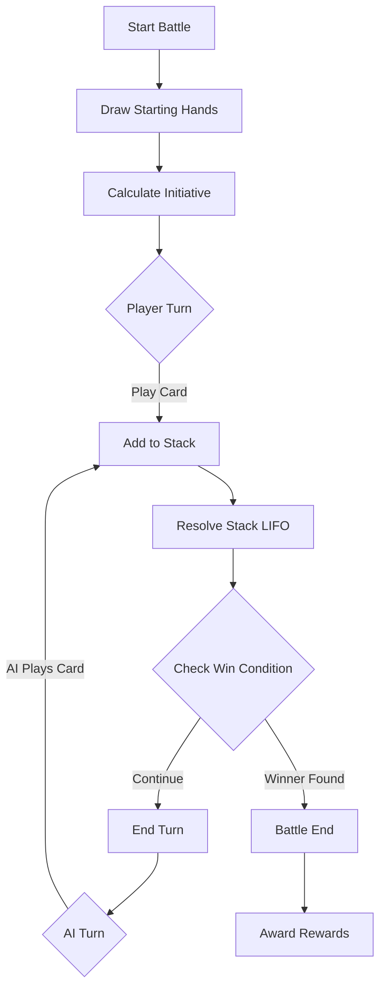

# ⚔️ Battle System

## Overview
The Battle System handles all combat functionality including card-based battles, turn management, effect resolution, and AI opponents.

## Purpose
- **Build from scratch** - Previous implementation never worked
- Provide working turn-based card battle system
- Handle PvP and PvE battles
- Manage LIFO stack-based effect resolution
- Support AI opponents with configurable behavior
- Integrate with quest system for battle objectives

## Structure

```
battle/
├── README.md (this file)
├── ui/                  # Battle screen UI components
│   ├── BattleScreen.tsx         # Main battle screen container (~200 lines)
│   ├── BattleField.tsx          # Battle field display (~150 lines)
│   ├── PlayerArea.tsx           # Player HP/mana/stats (~100 lines)
│   ├── OpponentArea.tsx         # Opponent HP/mana/stats (~100 lines)
│   ├── HandDisplay.tsx          # Player's hand of cards (~150 lines)
│   ├── StackDisplay.tsx         # Effect stack visualization (~100 lines)
│   └── index.ts
├── engine/              # Core battle logic
│   ├── BattleEngine.ts          # Main battle state machine (~300 lines)
│   ├── TurnManager.ts           # Turn order and timing (~200 lines)
│   ├── StackResolver.ts         # LIFO effect stack (~250 lines)
│   ├── EffectProcessor.ts       # Process card effects (~200 lines)
│   └── index.ts
├── cards/               # Card rendering and actions
│   ├── CardRenderer.tsx         # Render game cards (~150 lines)
│   ├── CardActions.ts           # Card play/discard logic (~150 lines)
│   ├── CardEffects.ts           # Card effect definitions (~200 lines)
│   └── index.ts
├── ai/                  # AI opponent logic
│   ├── AIController.ts          # AI decision making (~250 lines)
│   ├── AIStrategy.ts            # AI behavior patterns (~200 lines)
│   └── index.ts
├── hooks/               # React hooks for battles
│   ├── useBattle.ts             # Main battle hook (~150 lines)
│   ├── useBattleActions.ts      # Battle actions hook (~150 lines)
│   └── index.ts
└── types.ts             # Battle-specific types
```

## Key Features

### 1. Battle UI (`ui/`)

**BattleScreen.tsx** - Main battle container
```typescript
<BattleScreen battleId="battle_123">
  <OpponentArea />
  <BattleField />
  <PlayerArea />
  <HandDisplay />
  <StackDisplay />
</BattleScreen>
```

**Components:**
- **BattleField.tsx**: Central battlefield area showing active cards/effects
- **PlayerArea.tsx**: Player stats (HP, mana, deck count, discard count)
- **OpponentArea.tsx**: Opponent stats (HP, mana, deck count)
- **HandDisplay.tsx**: Player's hand of cards (drag to play)
- **StackDisplay.tsx**: Visual stack of effects resolving (LIFO order)

### 2. Battle Engine (`engine/`)

**BattleEngine.ts** - Core battle state machine
```typescript
class BattleEngine {
  // Initialize battle
  async start(player1: Character, player2: Character): Promise<Battle>;

  // Play a card
  async playCard(cardId: string, targets?: Target[]): Promise<void>;

  // Pass turn
  async passTurn(): Promise<void>;

  // Check win condition
  checkWinCondition(): 'player1' | 'player2' | 'draw' | null;

  // Get current battle state
  getState(): BattleState;
}
```

**TurnManager.ts** - Turn order and timing
```typescript
class TurnManager {
  // Start new turn
  startTurn(playerId: string): void;

  // End current turn
  endTurn(): void;

  // Get current turn player
  getCurrentPlayer(): string;

  // Calculate turn order
  calculateInitiative(players: Player[]): string[];
}
```

**StackResolver.ts** - LIFO effect stack resolution
```typescript
class StackResolver {
  // Add effect to stack
  push(effect: StackItem): void;

  // Resolve top of stack (LIFO)
  async resolveNext(): Promise<void>;

  // Resolve entire stack
  async resolveAll(): Promise<void>;

  // Get stack contents
  getStack(): StackItem[];
}
```

**EffectProcessor.ts** - Process card effects
```typescript
class EffectProcessor {
  // Process a single effect
  async processEffect(effect: EffectDef, context: BattleContext): Promise<void>;

  // Supported effects:
  // - Damage (deal damage)
  // - Heal (restore HP)
  // - Draw (draw cards)
  // - Mana (gain/lose mana)
  // - Status (apply buffs/debuffs)
  // - Summon (summon creatures)
  // - Transform (change cards)
}
```

### 3. Card System (`cards/`)

**CardRenderer.tsx** - Render cards visually
```typescript
<CardRenderer
  card={card}
  onClick={() => playCard(card.id)}
  disabled={!canPlay(card)}
/>
```

**CardActions.ts** - Card play logic
```typescript
class CardActions {
  // Can player afford to play card?
  canPlay(card: GameCard, player: BattlePlayerState): boolean;

  // Play card from hand
  async playCard(card: GameCard, targets?: Target[]): Promise<void>;

  // Discard card
  discardCard(cardId: string): void;

  // Draw cards
  drawCards(count: number): GameCard[];
}
```

**CardEffects.ts** - Card effect definitions
```typescript
const CARD_EFFECTS = {
  fireball: {
    type: 'damage',
    amount: 5,
    target: 'enemy',
    element: 'fire'
  },
  heal: {
    type: 'heal',
    amount: 3,
    target: 'self'
  },
  draw: {
    type: 'draw',
    count: 2
  }
};
```

### 4. AI System (`ai/`)

**AIController.ts** - AI decision making
```typescript
class AIController {
  // Choose best card to play
  async chooseCard(
    hand: GameCard[],
    battleState: BattleState
  ): Promise<{ card: GameCard; targets: Target[] }>;

  // Evaluate board state
  evaluateBoardState(state: BattleState): number;

  // Decide whether to attack or defend
  getStrategy(state: BattleState): 'aggressive' | 'defensive' | 'balanced';
}
```

**AIStrategy.ts** - AI behavior patterns
```typescript
const AI_STRATEGIES = {
  aggressive: {
    preferDamage: 0.8,
    preferDefense: 0.1,
    preferDraw: 0.1
  },
  defensive: {
    preferDamage: 0.2,
    preferDefense: 0.7,
    preferDraw: 0.1
  },
  balanced: {
    preferDamage: 0.4,
    preferDefense: 0.4,
    preferDraw: 0.2
  }
};
```

## Battle Flow



## Usage

### Starting a Battle
```typescript
import { useBattle } from '@/features/battle/hooks';

function QuestBattleScreen({ questId, enemyId }) {
  const { battle, startBattle, loading } = useBattle();

  useEffect(() => {
    startBattle({
      type: 'pve',
      player: currentCharacter,
      enemy: enemyId
    });
  }, []);

  if (loading) return <LoadingSpinner />;
  if (!battle) return <ErrorScreen />;

  return <BattleScreen battleId={battle.id} />;
}
```

### Playing Cards
```typescript
import { useBattleActions } from '@/features/battle/hooks';

function PlayerHand() {
  const { hand, playCard, canPlayCard } = useBattleActions();

  return (
    <View>
      {hand.map(card => (
        <CardRenderer
          key={card.id}
          card={card}
          onClick={() => playCard(card.id)}
          disabled={!canPlayCard(card)}
        />
      ))}
    </View>
  );
}
```

### Watching Battle State
```typescript
import { useBattle } from '@/features/battle/hooks';

function BattleStatus() {
  const { battle } = useBattle('battle_123');

  if (!battle) return null;

  return (
    <View>
      <Text>Turn: {battle.currentTurn}</Text>
      <Text>Player HP: {battle.player.hp}/{battle.player.maxHp}</Text>
      <Text>Enemy HP: {battle.enemy.hp}/{battle.enemy.maxHp}</Text>
      <Text>Stack: {battle.stack.length} effects</Text>
    </View>
  );
}
```

## Win Conditions

- **Last Player Standing**: Opponent's HP reaches 0
- **Deck Out**: Player cannot draw required cards (loses)
- **Surrender**: Player manually forfeits

## Firebase Integration

### Collections
- `/battles/{battleId}` - Active battle state (real-time)
- `/battleHistory/{userId}/{battleId}` - Completed battles

### Real-time Sync
```typescript
// Battle state updates in real-time via onSnapshot()
// Both players see updates instantly
// Stack resolution synchronized across clients
```

## AI Editing Guide

### To change battle UI layout:
Edit: `ui/BattleScreen.tsx` (~200 lines)

### To modify turn logic:
Edit: `engine/TurnManager.ts` (~200 lines)

### To add new card effects:
1. Edit: `cards/CardEffects.ts` (add effect definition)
2. Edit: `engine/EffectProcessor.ts` (add effect handler)

### To improve AI behavior:
Edit: `ai/AIController.ts` (~250 lines)

### To change win conditions:
Edit: `engine/BattleEngine.ts` - `checkWinCondition()` method

## Dependencies
- `@rov/logic` - Shared game logic engine
- `@rov/types` - Type definitions
- `firebase/firestore` - Battle state storage
- `features/character` - Character stats
- `features/inventory` - Player decks
- `features/quests` - Quest integration

## Related Features
- **Quests** (`features/quests/`) - Battle objectives
- **Character** (`features/character/`) - Character stats/abilities
- **Inventory** (`features/inventory/`) - Card collection
- **Decks** (`features/decks/`) - Deck building

## Testing
```bash
# Run battle tests
pnpm test features/battle/

# Test battle engine
pnpm test features/battle/engine/BattleEngine.test.ts

# Test AI
pnpm test features/battle/ai/AIController.test.ts
```

## Known Issues
- **CRITICAL**: Battle system doesn't currently work - needs to be built from scratch
- Previous implementation never appeared in app
- This module is a **complete rewrite**

## Implementation Status
- [ ] Battle UI components
- [ ] Battle engine core
- [ ] Turn management
- [ ] Stack resolver
- [ ] Effect processor
- [ ] AI controller
- [ ] Firebase integration
- [ ] Quest integration
- [ ] Testing

## Future Enhancements
- [ ] Spectator mode
- [ ] Battle replays
- [ ] Tournament system
- [ ] Ranked PvP
- [ ] Team battles (2v2, 3v3)
